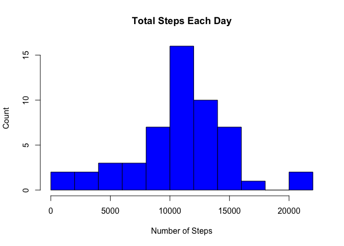

# Coursera - Reproducible Research 
## Week 2 Assignement

## Loading and preprocessing the data
#### 1. Load the data (i.e. read.csv())

```r
if(!file.exists('activity.csv')){
    #Unzip activity.csv
    unzip('activity.zip')
}
# Read activity.csv into a data frame 
activity <- read.csv('activity.csv')

# Check activity with head
head(activity)
```

```
##   steps       date interval
## 1    NA 2012-10-01        0
## 2    NA 2012-10-01        5
## 3    NA 2012-10-01       10
## 4    NA 2012-10-01       15
## 5    NA 2012-10-01       20
## 6    NA 2012-10-01       25
```

```r
#### Some NA values 

# Check dimensions of activity
dim(activity)
```

```
## [1] 17568     3
```

```r
#### 17568 observations for 3 variables

# Summarize activity 
summary(activity)
```

```
##      steps                date          interval     
##  Min.   :  0.00   2012-10-01:  288   Min.   :   0.0  
##  1st Qu.:  0.00   2012-10-02:  288   1st Qu.: 588.8  
##  Median :  0.00   2012-10-03:  288   Median :1177.5  
##  Mean   : 37.38   2012-10-04:  288   Mean   :1177.5  
##  3rd Qu.: 12.00   2012-10-05:  288   3rd Qu.:1766.2  
##  Max.   :806.00   2012-10-06:  288   Max.   :2355.0  
##  NA's   :2304     (Other)   :15840
```

#### 2. Process/transform the data (if necessary) into a format suitable for your analysis

```r
# Alter Date variable type to a Date Class 
activity$date <- as.Date(as.character(activity$date))
# Remove NA in Steps variable for later calculations
activity_cleaned <- activity[!is.na(activity$steps),]
```

## What is mean total number of steps taken per day?

```r
#### 1. Calculate the total number of steps taken per day
steps_by_day <- aggregate(activity$steps, by = list(Date = activity$date), FUN = sum)
# rename summarised variable
names(steps_by_day)[2] ="Number of Steps"
# Head od Steps by day
head(steps_by_day)
```

```
##         Date Number of Steps
## 1 2012-10-01              NA
## 2 2012-10-02             126
## 3 2012-10-03           11352
## 4 2012-10-04           12116
## 5 2012-10-05           13294
## 6 2012-10-06           15420
```

```r
#### 2. Make a histogram of the total number of steps taken each day
hist(steps_by_day$`Number of Steps`, main = paste("Total Steps Each Day"), col="blue", xlab="Number of Steps",ylab="Count",breaks=10)
```

<!-- -->

```r
steps_mean <- mean(na.omit(steps_by_day$`Number of Steps`))
steps_median <- median(na.omit(steps_by_day$`Number of Steps`))
```
The mean is 1.0766189\times 10^{4} and the median is 10765.  

##What is the average daily activity pattern?

```r
#### 1. Make a time series plot (i.e. type="l") of the 5-minute interval (x-axis) and the average number of steps taken, averaged across all days (y-axis)
steps_by_interval <- aggregate(steps ~ interval, data = activity, FUN =mean)

# Head of steps by interval
head(steps_by_interval)
```

```
##   interval     steps
## 1        0 1.7169811
## 2        5 0.3396226
## 3       10 0.1320755
## 4       15 0.1509434
## 5       20 0.0754717
## 6       25 2.0943396
```

```r
# Plot the Time Series
plot(steps_by_interval$interval,steps_by_interval$steps, type="l", xlab="5-minute Interval", ylab="Number of Steps",main="Average Number of Steps per Day by Interval")
```

<!-- -->

```r
#### 2. Which 5-minute interval, on average across all the days in the dataset, contains the maximum number of steps?
max_steps_by_interval <- steps_by_interval[which(steps_by_interval$steps==max(steps_by_interval$steps)),]
```
The 5-minute interval, on average across all the days in the dataset, containing the maximum number of steps is 835, 206.1698113.  

## Imputing missing values

```r
#### 1. Calculate and report the total number of missing values in the dataset (i.e. the total number of rows with NAs)
missing <- sum(is.na(activity))
```
The total number of missing values in the dataset activity is 2304.  


```r
library(dplyr)
```

```
## Warning: package 'dplyr' was built under R version 3.5.2
```

```
## 
## Attaching package: 'dplyr'
```

```
## The following objects are masked from 'package:stats':
## 
##     filter, lag
```

```
## The following objects are masked from 'package:base':
## 
##     intersect, setdiff, setequal, union
```

```r
#### 2. Devise a strategy for filling in all of the missing values in the dataset. 
# Function to replace x when x is NA by mean of x
Replace_by_mean <- function(x) replace(x, is.na(x), mean(x, na.rm = TRUE))

# Create new data frame with mean instead by interval
activity_with_mean <- (activity %>%group_by(interval)%>%mutate(steps=Replace_by_mean(steps)))
head(activity_with_mean)
```

```
## # A tibble: 6 x 3
## # Groups:   interval [6]
##    steps date       interval
##    <dbl> <date>        <int>
## 1 1.72   2012-10-01        0
## 2 0.340  2012-10-01        5
## 3 0.132  2012-10-01       10
## 4 0.151  2012-10-01       15
## 5 0.0755 2012-10-01       20
## 6 2.09   2012-10-01       25
```

```r
# Calculate missing value in the corrected data frame
missing2 <- sum(is.na(activity_with_mean))
```
After imputing missing values, the total number of missing values is now 0.  


```r
#### 3. Create a new dataset that is equal to the original dataset but with the missing data filled in.
imputed_activity <- as.data.frame(activity_with_mean)
head(imputed_activity)
```

```
##       steps       date interval
## 1 1.7169811 2012-10-01        0
## 2 0.3396226 2012-10-01        5
## 3 0.1320755 2012-10-01       10
## 4 0.1509434 2012-10-01       15
## 5 0.0754717 2012-10-01       20
## 6 2.0943396 2012-10-01       25
```

```r
#### 4. Make a histogram of the total number of steps taken each day and Calculate and report the mean and median total number of steps taken per day. 
imputed_steps_by_day <- aggregate(imputed_activity$steps, by = list(Date = imputed_activity$date), FUN = sum)
names(imputed_steps_by_day)[2] ="Number of Steps"
hist(imputed_steps_by_day$'Number of Steps', main = paste("Total Steps Each Day after Imputation of Missing Values"), col="blue",xlab="Number of Steps",ylab="Count",breaks=10)
```

<!-- -->

```r
imputed_steps_mean <- mean(na.omit(imputed_steps_by_day$`Number of Steps`))
imputed_steps_median <- median(na.omit(imputed_steps_by_day$`Number of Steps`))
```
We can see that mean value between original data (mean : 1.0766189\times 10^{4}) frame vs imputed data (mean : 1.0766189\times 10^{4}) are identical.  
But, we can also notice that the imputation of missing value altered the median as the imputed data results in a higher median (median : 1.0766189\times 10^{4}) than the original data (median : 10765).  

## Are there differences in activity patterns between weekdays and weekends?

```r
library(lattice)
#### 1. Create a new factor variable in the dataset with two levels – “weekday” and “weekend” indicating whether a given date is a weekday or weekend day.
weekdays <- c("Lundi", "Mardi", "Mercredi", "Jeudi", "Vendredi")
imputed_activity$day_of_week = as.factor(ifelse(is.element(weekdays(as.Date(imputed_activity$date)),weekdays), "Weekday", "Weekend"))
head(imputed_activity)
```

```
##       steps       date interval day_of_week
## 1 1.7169811 2012-10-01        0     Weekday
## 2 0.3396226 2012-10-01        5     Weekday
## 3 0.1320755 2012-10-01       10     Weekday
## 4 0.1509434 2012-10-01       15     Weekday
## 5 0.0754717 2012-10-01       20     Weekday
## 6 2.0943396 2012-10-01       25     Weekday
```

```r
#### 2 . Make a panel plot containing a time series plot (i.e. type="l") of the 5-minute interval (x-axis) and the average number of steps taken, averaged across all weekday days or weekend days (y-axis). 
steps_by_interval_and_dow <- aggregate(steps ~ interval + day_of_week, imputed_activity, mean)
xyplot(steps_by_interval_and_dow$steps ~ steps_by_interval_and_dow$interval|steps_by_interval_and_dow$day_of_week, main="Average Steps per Day by Interval",xlab="Interval", ylab="Steps",layout=c(1,2), type="l")
```

<!-- -->
